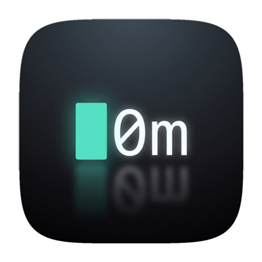

<p align="center">
  
</p>

Fast, light, and fully open-source. Run Docker containers and Kubernetes on macOS in a ~15 MB desktop app — powered by [Lima](https://github.com/lima-vm/lima).


## Why 0ma?

- **~15 MB** — Not a 1 GB install. Built with Tauri and Rust.
- **Docker & Kubernetes** — One-click setup for both. Same workflow, without the overhead.
- **Built-in Terminal** — Multiple tabs and split panes.
- **Auto Environment Setup** — One click sets `DOCKER_HOST` and `KUBECONFIG` in your shell. Your local `docker` and `kubectl` just work.
- **Visual Config Editor** — Edit Lima YAML, or use visual controls for CPUs, memory, port forwards, mounts, and provisioning.

## Installation

### Homebrew (Recommended)

```bash
brew install chenhunghan/tap/0ma
```

### Download

Download the latest release for macOS (Apple Silicon & Intel):

**[Download 0ma for macOS](https://github.com/chenhunghan/0ma/releases)**

1. Download the `.dmg` file from the Releases page.
2. Open the disk image and drag **0ma** to your **Applications** folder.
3. Remove the quarantine attribute (the binary is unsigned):
   ```bash
   xattr -cr /Applications/0ma.app
   ```
4. Launch 0ma from your Applications directory.

### Build from Source

**Requirements:**

- Node.js (v18+)
- Rust (latest stable)
- `limactl` installed and available in PATH

```bash
git clone https://github.com/chenhunghan/0ma.git
cd 0ma
npm install
npm run tauri dev       # development
npm run tauri build     # production
```

## License

Copyright 2025 Hung-Han Chen <chenhungh@gmail.com>.

Licensed under the dual [MIT](LICENSE-MIT) and [Apache-2.0](LICENSE-APACHE) licenses.
