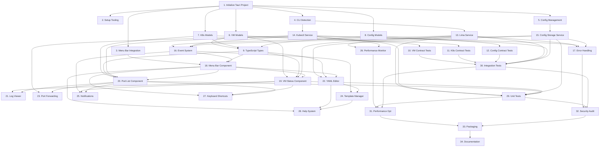

# Implementation Tasks: Lima VM Manager Application

**Branch**: `001-build-an-application` | **Date**: 2025-10-05 | **Spec**: [/specs/001-build-an-application/spec.md](spec.md)
**Generated from**: Phase 1 design documents (contracts, data-model.md, quickstart.md)
**Total Tasks**: 34 | **Estimated Effort**: 8-12 weeks

## Task Execution Guidelines

- **[P]** marks tasks that can be executed in parallel
- Tasks are ordered by dependency (TDD: tests before implementation)
- Each task includes verification criteria
- Follow constitutional principles throughout implementation

---

## Phase 1: Project Setup & Infrastructure (Tasks 1-5)

### 1. Initialize Tauri Project Structure
**Priority**: High | **Dependencies**: None | **Estimated**: 2 hours

Initialize the Tauri 2.0 project with proper directory structure and configuration files.

**Acceptance Criteria**:
- [ ] `lima-vm-manager/` directory exists with standard Tauri structure
- [ ] `src-tauri/Cargo.toml` with required dependencies (tauri 2.0, tokio, serde)
- [ ] `src/` directory with React TypeScript setup
- [ ] `package.json` with React 18+, TypeScript, Tailwind CSS
- [ ] `.gitignore` excludes target/, node_modules/, dist/
- [ ] `tauri dev` command runs successfully

**Files to Create**:
- `lima-vm-manager/src-tauri/Cargo.toml`
- `lima-vm-manager/src-tauri/tauri.conf.json`
- `lima-vm-manager/src/package.json`
- `lima-vm-manager/src/tsconfig.json`
- `lima-vm-manager/.gitignore`

**Verification**: Run `npm run tauri dev` - should show blank window successfully

---

### 2. Setup Development Environment and Tooling [P]
**Priority**: High | **Dependencies**: Task 1 | **Estimated**: 1 hour

Configure code quality tools, linting, and testing infrastructure.

**Acceptance Criteria**:
- [ ] ESLint + Prettier configured for TypeScript/React
- [ ] Cargo clippy and fmt configured for Rust
- [ ] Jest setup for React component testing
- [ ] Cargo test setup for Rust unit testing
- [ ] Pre-commit hooks with lint-staged
- [ ] VS Code workspace settings

**Files to Create**:
- `.eslintrc.js`, `.prettierrc`, `jest.config.js`
- `.cargo/config.toml` (for clippy configuration)
- `.husky/pre-commit` hook
- `.vscode/settings.json`

**Verification**: `npm run lint` and `cargo clippy` pass on empty project

---

### 3. Configure macOS Menu Bar Integration
**Priority**: High | **Dependencies**: Task 1 | **Estimated**: 3 hours

Set up Tauri configuration for macOS system tray and menu bar integration.

**Acceptance Criteria**:
- [ ] Tauri config includes system tray configuration
- [ ] Menu bar icon and basic menu structure
- [ ] Window configuration for dropdown/popup UI
- [ ] macOS-specific permissions and capabilities
- [ ] Basic menu bar click handler

**Files to Create**:
- `src-tauri/tauri.conf.json` (menu bar section)
- `src-tauri/src/main.rs` (basic menu bar setup)
- `src-tauri/icons/` (menu bar icon assets)

**Verification**: Application appears in macOS menu bar on launch

---

### 4. Implement CLI Tool Detection and Validation
**Priority**: High | **Dependencies**: Task 1 | **Estimated**: 2 hours

Create service to detect and validate limactl and kubectl installation.

**Acceptance Criteria**:
- [ ] Detect limactl v1.2.0+ installation
- [ ] Detect kubectl v1.28+ installation
- [ ] Validate CLI tool versions and permissions
- [ ] Graceful error handling for missing tools
- [ ] CLI path resolution and caching

**Files to Create**:
- `src-tauri/src/services/cli_detection.rs`
- `src-tauri/src/models/cli_tools.rs`
- Integration tests for CLI detection

**Verification**: Returns proper error when limactl/kubectl missing, success when present

---

### 5. Setup Application Configuration Management
**Priority**: Medium | **Dependencies**: Task 1 | **Estimated**: 2 hours

Implement application configuration storage and management system.

**Acceptance Criteria**:
- [ ] Application configuration directory setup
- [ ] Config file storage and retrieval
- [ ] Default configuration templates
- [ ] Configuration validation and error handling
- [ ] Settings persistence across app restarts

**Files to Create**:
- `src-tauri/src/services/config.rs`
- `src-tauri/src/models/config.rs`
- Default configuration templates

**Verification**: Config persists correctly across app restarts

---

## Phase 2: Contract Tests & Data Models (Tasks 6-12)

### 6. Create Rust Data Models for VM Operations
**Priority**: High | **Dependencies**: Task 1 | **Estimated**: 3 hours

Implement core data structures for VM state and operations.

**Acceptance Criteria**:
- [ ] VirtualMachine struct with all required fields
- [ ] VMStatus enum with all states (Running, Stopped, etc.)
- [ ] VMOperation and VMOperationResult types
- [ ] Serde serialization/deserialization
- [ ] Validation methods for VM configurations

**Files to Create**:
- `src-tauri/src/models/vm.rs`
- `src-tauri/src/models/mod.rs`
- Unit tests for VM models

**Verification**: All model validation tests pass

---

### 7. Create Rust Data Models for Kubernetes Resources [P]
**Priority**: High | **Dependencies**: Task 1 | **Estimated**: 3 hours

Implement data structures for Kubernetes cluster, pods, and containers.

**Acceptance Criteria**:
- [ ] KubernetesCluster struct
- [ ] KubernetesPod with status and container info
- [ ] KubernetesContainer and ContainerStatus
- [ ] KubernetesNode with resource information
- [ ] Serde serialization for all models

**Files to Create**:
- `src-tauri/src/models/k8s.rs`
- Unit tests for Kubernetes models

**Verification**: Models correctly parse kubectl JSON output

---

### 8. Create Rust Data Models for Configuration Management [P]
**Priority**: High | **Dependencies**: Task 1 | **Estimated**: 2 hours

Implement data structures for configuration files and validation.

**Acceptance Criteria**:
- [ ] ConfigurationFile struct
- [ ] ValidationResult with errors and warnings
- [ ] ConfigurationHistory for version tracking
- [ ] ConfigTemplate and TemplateVariable
- [ ] YAML parsing and validation

**Files to Create**:
- `src-tauri/src/models/config.rs`
- Unit tests for configuration models

**Verification**: Configuration validation works correctly

---

### 9. Create TypeScript Type Definitions
**Priority**: High | **Dependencies**: Tasks 6-8 | **Estimated**: 2 hours

Generate TypeScript types matching Rust models for frontend consistency.

**Acceptance Criteria**:
- [ ] TypeScript interfaces for all Rust models
- [ ] Event payload types for real-time updates
- [ ] API request/response types
- [ ] Consistent naming with Rust models
- [ ] Type validation utilities

**Files to Create**:
- `src/types/index.ts`
- `src/types/vm.ts`
- `src/types/k8s.ts`
- `src/types/config.ts`

**Verification**: TypeScript compilation succeeds with no type errors

---

### 10. Implement VM Operations Contract Tests
**Priority**: High | **Dependencies**: Tasks 6, 9 | **Estimated**: 3 hours

Create failing tests for VM management API contracts.

**Acceptance Criteria**:
- [ ] Test for get_vm_status command
- [ ] Test for start_vm command
- [ ] Test for stop_vm command
- [ ] Test for suspend_vm command
- [ ] Test for terminate_vm command
- [ ] Error handling tests for each operation
- [ ] All tests initially fail (no implementation)

**Files to Create**:
- `tests/integration/vm_operations.test.ts`
- `src-tauri/src/commands/vm.rs` (stub implementations)

**Verification**: All contract tests fail with "not implemented" errors

---

### 11. Implement Kubernetes Monitoring Contract Tests
**Priority**: High | **Dependencies**: Tasks 7, 9 | **Estimated**: 3 hours

Create failing tests for Kubernetes monitoring API contracts.

**Acceptance Criteria**:
- [ ] Test for get_pods command
- [ ] Test for get_pod_logs command
- [ ] Test for get_nodes command
- [ ] Test for get_cluster_info command
- [ ] Test for port_forward command
- [ ] Log streaming tests
- [ ] All tests initially fail

**Files to Create**:
- `tests/integration/k8s_monitoring.test.ts`
- `src-tauri/src/commands/k8s.rs` (stub implementations)

**Verification**: All contract tests fail with "not implemented" errors

---

### 12. Implement Configuration Management Contract Tests
**Priority**: High | **Dependencies**: Tasks 8, 9 | **Estimated**: 3 hours

Create failing tests for configuration management API contracts.

**Acceptance Criteria**:
- [ ] Test for get_config command
- [ ] Test for update_config command
- [ ] Test for validate_config command
- [ ] Test for get_config_history command
- [ ] Test for restore_config command
- [ ] Template management tests
- [ ] All tests initially fail

**Files to Create**:
- `tests/integration/config_management.test.ts`
- `src-tauri/src/commands/config.rs` (stub implementations)

**Verification**: All contract tests fail with "not implemented" errors

---

## Phase 3: Core Service Implementation (Tasks 13-20)

### 13. Implement Lima CLI Wrapper Service
**Priority**: High | **Dependencies**: Tasks 4, 6, 10 | **Estimated**: 4 hours

Create service to interact with limactl for VM operations.

**Acceptance Criteria**:
- [ ] LimaService struct with CLI wrapper methods
- [ ] start_vm() method implementation
- [ ] stop_vm() method implementation
- [ ] get_vm_status() method implementation
- [ ] Proper error handling and command execution
- [ ] Async/await support with tokio

**Files to Create**:
- `src-tauri/src/services/lima.rs`
- Unit tests for LimaService

**Verification**: VM operations contract tests (Task 10) start passing

---

### 14. Implement kubectl CLI Wrapper Service [P]
**Priority**: High | **Dependencies**: Tasks 4, 7, 11 | **Estimated**: 4 hours

Create service to interact with kubectl for Kubernetes operations.

**Acceptance Criteria**:
- [ ] KubectlService struct with CLI wrapper methods
- [ ] get_pods() method with filtering support
- [ ] get_pod_logs() with streaming capability
- [ ] get_nodes() and get_cluster_info() methods
- [ ] port_forward() with session management
- [ ] kubeconfig file handling

**Files to Create**:
- `src-tauri/src/services/kubectl.rs`
- Unit tests for KubectlService

**Verification**: Kubernetes monitoring contract tests (Task 11) start passing

---

### 15. Implement Configuration Storage Service [P]
**Priority**: High | **Dependencies**: Tasks 5, 8, 12 | **Estimated**: 3 hours

Create service for configuration file management and validation.

**Acceptance Criteria**:
- [ ] ConfigService struct for file operations
- [ ] YAML configuration parsing and validation
- [ ] Configuration history tracking
- [ ] Template management system
- [ ] File backup and restore functionality
- [ ] Error handling for invalid configurations

**Files to Create**:
- `src-tauri/src/services/config_storage.rs`
- Unit tests for ConfigService

**Verification**: Configuration management contract tests (Task 12) start passing

---

### 16. Implement Event System for Real-time Updates
**Priority**: High | **Dependencies**: Tasks 13, 14, 15 | **Estimated**: 3 hours

Create event-driven communication system between backend and frontend.

**Acceptance Criteria**:
- [ ] Event emission system in Rust backend
- [ ] Event subscription system in React frontend
- [ ] VM status change events
- [ ] Pod status update events
- [ ] Configuration change events
- [ ] Log streaming events
- [ ] Event filtering and throttling

**Files to Create**:
- `src-tauri/src/services/events.rs`
- `src/services/events.ts`
- Event type definitions

**Verification**: Real-time updates work in UI without polling

---

### 17. Implement Error Handling and Logging System
**Priority**: Medium | **Dependencies**: Tasks 13, 14, 15 | **Estimated**: 2 hours

Create comprehensive error handling and logging infrastructure.

**Acceptance Criteria**:
- [ ] Custom error types for different domains
- [ ] Structured logging with different levels
- [ ] Error context and user-friendly messages
- [ ] Error recovery mechanisms
- [ ] Log file management
- [ ] Error reporting for debugging

**Files to Create**:
- `src-tauri/src/utils/error.rs`
- `src-tauri/src/utils/logging.rs`
- Error handling middleware

**Verification**: All errors are properly logged and displayed to users

---

### 18. Create Basic React Menu Bar Component
**Priority**: High | **Dependencies**: Tasks 3, 9, 16 | **Estimated**: 3 hours

Implement the main menu bar UI component.

**Acceptance Criteria**:
- [ ] MenuBar component with dropdown interface
- [ ] Integration with Tauri system tray
- [ ] Responsive design for macOS menu bar
- [ ] Keyboard navigation support
- [ ] Click outside to close functionality
- [ ] Loading and error states

**Files to Create**:
- `src/components/MenuBar.tsx`
- `src/components/MenuBar.module.css`
- Storybook stories for MenuBar

**Verification**: Menu bar shows/hides correctly on click

---

### 19. Create VM Status Display Component
**Priority**: High | **Dependencies**: Tasks 6, 9, 13, 18 | **Estimated**: 3 hours

Implement component to display VM status and controls.

**Acceptance Criteria**:
- [ ] VMStatus display with current state
- [ ] Start/Stop/Suspend/Terminate buttons
- [ ] Loading states for operations
- [ ] Error display and retry options
- [ ] Real-time status updates
- [ ] Disabled buttons based on VM state

**Files to Create**:
- `src/components/VMStatus.tsx`
- `src/components/VMControls.tsx`
- Component tests

**Verification**: VM controls work correctly with real VM state

---

### 20. Create Pod List Component [P]
**Priority**: High | **Dependencies**: Tasks 7, 9, 14, 18 | **Estimated**: 3 hours

Implement component to display Kubernetes pod status.

**Acceptance Criteria**:
- [ ] PodList component with namespace filtering
- [ ] Pod status indicators (Running, Pending, Failed)
- [ ] Resource usage display (CPU, Memory)
- [ ] Restart count and age display
- [ ] Search and filter functionality
- [ ] Real-time pod status updates

**Files to Create**:
- `src/components/PodList.tsx`
- `src/components/PodStatusIndicator.tsx`
- Component tests

**Verification**: Pod list updates in real-time with cluster changes

---

## Phase 4: Advanced Features (Tasks 21-28)

### 21. Create Log Viewer Component
**Priority Medium** | **Dependencies**: Tasks 9, 14, 20 | **Estimated**: 4 hours

Implement component for viewing and streaming pod logs.

**Acceptance Criteria**:
- [ ] LogViewer with scrollable log display
- [ ] Real-time log streaming
- [ ] Log search and filtering
- [ ] Multiple container support
- [ ] Log level filtering
- [ ] Export logs functionality
- [ ] Auto-scroll and pause options

**Files to Create**:
- `src/components/LogViewer.tsx`
- `src/components/LogControls.tsx`
- Log formatting utilities

**Verification**: Log streaming works smoothly without performance issues

---

### 22. Create YAML Configuration Editor
**Priority**: Medium | **Dependencies**: Tasks 8, 9, 15, 18 | **Estimated**: 5 hours

Implement component for editing VM configuration YAML.

**Acceptance Criteria**:
- [ ] YamlEditor with syntax highlighting
- [ ] Real-time YAML validation
- [ ] Error display with line numbers
- [ ] Auto-completion for Lima configuration
- [ ] Save/cancel/reset functionality
- [ ] Configuration history integration
- [ ] Template selection dropdown

**Files to Create**:
- `src/components/YamlEditor.tsx`
- `src/components/YamlValidation.tsx`
- YAML validation utilities

**Verification**: YAML validation catches errors and provides helpful feedback

---

### 23. Implement Port Forwarding UI
**Priority**: Medium | **Dependencies**: Tasks 9, 14, 20 | **Estimated**: 3 hours

Create UI for managing port forwarding sessions.

**Acceptance Criteria**:
- [ ] PortForwarding component with session list
- [ ] Add new port forwarding dialog
- [ ] Active session status display
- [ ] Stop port forwarding functionality
- [ ] Connection status indicators
- [ ] Auto-open browser option

**Files to Create**:
- `src/components/PortForwarding.tsx`
- `src/components/PortForwardDialog.tsx`

**Verification**: Port forwarding works and can be accessed via browser

---

### 24. Create Configuration Template Management
**Priority**: Low | **Dependencies**: Tasks 8, 9, 15, 22 | **Estimated**: 3 hours

Implement system for managing configuration templates.

**Acceptance Criteria**:
- [ ] Template selection interface
- [ ] Create custom templates
- [ ] Template preview and validation
- [ ] Import/export templates
- [ ] Template category organization
- [ ] Variable substitution system

**Files to Create**:
- `src/components/TemplateManager.tsx`
- `src/components/TemplateEditor.tsx`
- Template processing utilities

**Verification**: Templates create valid configurations consistently

---

### 25. Add System Notifications and Alerts
**Priority**: Medium | **Dependencies**: Tasks 16, 19, 20 | **Estimated**: 2 hours

Implement macOS notifications for important events.

**Acceptance Criteria**:
- [ ] VM status change notifications
- [ ] Pod failure alerts
- [ ] Configuration error notifications
- [ ] System tray badge updates
- [ ] Notification preferences
- [ ] Quiet hours configuration

**Files to Create**:
- `src-tauri/src/services/notifications.rs`
- `src/services/notifications.ts`

**Verification**: Notifications appear for important system events

---

### 26. Implement Performance Monitoring
**Priority**: Low | **Dependencies**: Tasks 13, 14, 16 | **Estimated**: 3 hours

Add performance monitoring and metrics collection.

**Acceptance Criteria**:
- [ ] Resource usage tracking (CPU, Memory)
- [ ] API response time monitoring
- [ ] Error rate tracking
- [ ] Performance metrics dashboard
- [ ] Alert thresholds configuration
- [ ] Historical data storage

**Files to Create**:
- `src-tauri/src/services/metrics.rs`
- `src/components/PerformanceMonitor.tsx`

**Verification**: Performance metrics are accurate and updated regularly

---

### 27. Add Keyboard Shortcuts and Accessibility
**Priority**: Medium | **Dependencies**: Tasks 18, 19, 20 | **Estimated**: 2 hours

Implement keyboard shortcuts and improve accessibility.

**Acceptance Criteria**:
- [ ] Global keyboard shortcuts (Cmd+Shift+L, etc.)
- [ ] Menu navigation with keyboard
- [ ] Screen reader support
- [ ] High contrast mode support
- [ ] Focus management
- [ ] ARIA labels and roles

**Files to Create**:
- `src/services/keyboard_shortcuts.ts`
- Accessibility improvements to components

**Verification**: All functionality accessible via keyboard

---

### 28. Create Application Help and Documentation
**Priority**: Low | **Dependencies**: Tasks 18, 22, 24 | **Estimated**: 3 hours

Implement in-application help system.

**Acceptance Criteria**:
- [ ] Help modal with searchable documentation
- [ ] Interactive tutorials for first-time users
- [ ] Keyboard shortcuts reference
- [ ] Troubleshooting guide
- [ ] Link to external documentation
- [ ] Context-sensitive help

**Files to Create**:
- `src/components/HelpModal.tsx`
- `src/components/Tutorial.tsx`
- Help content files

**Verification**: Help system is comprehensive and easy to navigate

---

## Phase 5: Testing & Polish (Tasks 29-34)

### 29. Complete Unit Test Coverage
**Priority**: High | **Dependencies**: Tasks 13-20 | **Estimated**: 4 hours

Achieve comprehensive unit test coverage for all modules.

**Acceptance Criteria**:
- [ ] >90% test coverage for Rust backend
- [ ] >90% test coverage for TypeScript frontend
- [ ] All service modules fully tested
- [ ] All UI components tested
- [ ] Edge cases and error conditions tested
- [ ] Mock implementations for external dependencies

**Files to Create**:
- Unit tests for all remaining modules
- Test utilities and fixtures

**Verification**: Coverage reports meet targets, all tests pass

---

### 30. Implement Integration Test Suite
**Priority**: High | **Dependencies**: Tasks 10-12, 13-20 | **Estimated**: 4 hours

Create comprehensive integration tests for the complete application.

**Acceptance Criteria**:
- [ ] End-to-end user workflow tests
- [ ] VM lifecycle integration tests
- [ ] Kubernetes monitoring integration tests
- [ ] Configuration management integration tests
- [ ] Event system integration tests
- [ ] Error handling integration tests

**Files to Create**:
- `tests/integration/full_workflow.test.ts`
- Integration test utilities and helpers

**Verification**: All integration tests pass consistently

---

### 31. Performance Optimization and Profiling
**Priority**: Medium | **Dependencies**: Tasks 26, 29, 30 | **Estimated**: 3 hours

Optimize application performance based on metrics and profiling.

**Acceptance Criteria**:
- [ ] VM status updates within 2 seconds
- [ ] Pod log streaming <1s latency
- [ ] Configuration changes within 10 seconds
- [ ] Memory usage optimization
- [ ] CPU usage optimization
- [ ] Startup time optimization

**Files to Create**:
- Performance optimization improvements
- Benchmarking scripts

**Verification**: Performance targets met in profiling

---

### 32. Security Audit and Hardening
**Priority**: High | **Dependencies**: Tasks 17, 29, 30 | **Estimated**: 3 hours

Conduct security audit and implement security improvements.

**Acceptance Criteria**:
- [ ] Input validation for all user inputs
- [ ] CLI argument sanitization
- [ ] Secure configuration storage
- [ ] Permission minimization
- [ ] Security scan passes
- [ ] Dependency vulnerability scan

**Files to Create**:
- Security improvements and validations
- Security configuration files

**Verification**: Security audit passes with no critical issues

---

### 33. Create Application Packaging and Distribution
**Priority**: High | **Dependencies**: Tasks 31, 32 | **Estimated**: 3 hours

Set up application packaging for macOS distribution.

**Acceptance Criteria**:
- [ ] Production build configuration
- [ ] Code signing setup
- [ ] DMG packaging with installer
- [ ] Notarization configuration
- [ ] Update mechanism implementation
- [ ] Release automation setup

**Files to Create**:
- Build scripts and configurations
- Release automation files

**Verification**: Application installs and runs correctly from DMG

---

### 34. Final Documentation and Release Preparation
**Priority**: High | **Dependencies**: Task 33 | **Estimated**: 3 hours

Complete documentation and prepare for release.

**Acceptance Criteria**:
- [ ] Complete README with installation guide
- [ ] API documentation for all commands
- [ ] User manual with screenshots
- [ ] Contributing guidelines
- [ ] Change log for v1.0.0
- [ ] Release notes prepared

**Files to Create**:
- `README.md` (comprehensive)
- `docs/` directory with all documentation
- Release notes and change log

**Verification**: Documentation is complete and accurate

---

## Task Dependencies Graph

---

## Success Metrics

**Completion Criteria**:
- All 34 tasks completed
- All contract tests passing
- >90% test coverage
- Performance targets met
- Security audit passed
- Production build successfully packaged

**Quality Gates**:
- [ ] Constitution compliance maintained throughout
- [ ] All user stories from spec.md implemented
- [ ] Quickstart.md instructions work end-to-end
- [ ] Application passes all integration tests
- [ ] Performance requirements met (2s VM updates, 1s log streaming)

---

**Estimated Timeline**: 8-12 weeks (depending on team size and experience)
**Recommended Team Size**: 1-2 developers (full-stack)
**Critical Path**: Tasks 1 → 6 → 10 → 13 → 16 → 18 → 19 → 29 → 30 → 33 → 34